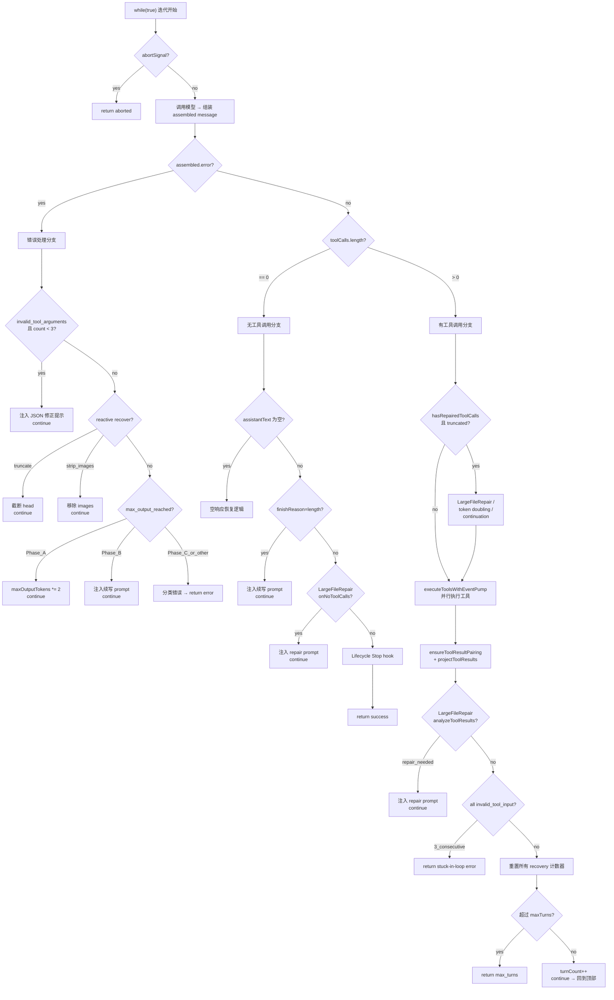

# PilotDeck AgentLoop 核心循环源码文档

源文件: `src/agent/loop/AgentLoop.ts`

---

## 1. 顶层结构

`AgentLoop.run()` 是一个 **AsyncGenerator** 方法，签名如下：

```typescript
async *run(input: AgentLoopInput): AsyncGenerator<AgentEvent, AgentLoopRunResult, unknown>
```

核心是一个 `while (true)` 无限循环。每次迭代 = 一次"内部 turn"（调用模型 + 处理结果）。循环有且仅有以下几种退出方式：
- `return` — 正常完成 / 错误终止 / abort
- 永远不会自行 `break`，只通过 `continue` 进入下一轮

---

## 2. 每轮迭代的固定前置步骤

```
while (true) {
  (1) 检查 abortSignal → 若 aborted → 返回 type:"aborted"
  (2) [略: auto-compact / router 相关]
  (3) createModelRequest — 构建 CanonicalModelRequest
  (4) [略: router.decide + execute — 发起模型流式调用]
  (5) assembleAssistantMessage(assembler) — 将流事件组装为完整 assistant message
  (6) 累加 usage，push assembled.message 到 messages[]
  (7) yield "assistant_message" 事件
  (8) collectToolCalls(assembled.message) — 提取 tool_call blocks
}
```

从步骤 (8) 之后进入三条主分支。

---

## 3. 分支一：assembled.error (模型返回了错误)

**入口条件**: `assembled.error` 存在（模型流中出现了 `error` 事件）

### 3.1 前置处理：补齐 tool_result

如果 error 发生时已经有部分 tool_calls 被 parse 出来，loop 会为每个 call 创建一个 `createMissingToolResult`（内容为 "Model error interrupted tool execution."），并 push 到 messages 中保持 pair 配对完整性。

### 3.2 JSON Self-Correct (code = `invalid_tool_arguments`)

- 条件: `config.jsonSelfCorrect === true` 且 `jsonSelfCorrectCount < 3`
- 行为: 注入 synthetic user message 提示模型"你的 JSON 无效，请重试"
- 限制: 最多 3 次
- 结果: `continue` 下一轮

### 3.3 Reactive Recovery (prompt_too_long / strip_images)

- 委托 `contextRuntime.recoverFromModelError()` 判断是否可恢复
- `truncate_head_and_retry`: 剥掉错误对，按 keepRatio 截断头部历史，标记 `hasAttemptedCompact=true`（单次守卫），然后 `continue`
- `strip_images_and_retry`: 剥掉错误对，移除所有 image blocks，然后 `continue`

### 3.4 max_output_reached — 三阶段恢复

当 error.code = `max_output_reached` 时：

| 阶段 | 守卫条件 | 行为 |
|------|----------|------|
| Phase A | `!hasAttemptedOutputRetry` | 剥掉错误对，`maxOutputTokens *= 2`（上限 64000），`continue` |
| Phase B | `maxOutputRecoveryCount < 50` | 保留截断的 assistant message，注入续写 prompt，`continue` |
| Phase C | 以上都不满足 | fall through，分类错误并返回 |

### 3.5 兜底：分类错误并终止

```typescript
const classified = classifyModelError(assembled.error);
// → stopReason = "prompt_too_long" | "model_error"
// → agentError code = "agent_prompt_too_long" | "agent_model_error"
```

触发 `StopFailure` lifecycle hook，yield `turn_failed` + `turn_completed`，return 退出循环。

---

## 4. 分支二：toolCalls.length === 0 (无工具调用 — 纯文本回复)

**入口条件**: `assembled.error` 为空 且 `collectToolCalls()` 返回空数组

### 4.1 空响应检测 (assistantText.length === 0)

模型回了一条"空"消息（通常因为 thinking 消耗了全部 output budget）。

- 先 `messages.pop()` 移除空 assistant message
- 情况 A（处于 continuation recovery 流程中）:
  - `consecutiveEmptyCount++`
  - 若 < 3 且 recoveryCount < 50 → 注入续写 prompt，`continue`
  - 若 >= 3 → 返回错误: "multiple consecutive empty responses"
- 情况 B（首次发生）:
  - 设 `hasAttemptedEmptyRetry = true`
  - 注入 "Your previous response was empty. Please provide visible text output."
  - `continue`
- 情况 C（已重试过仍为空）:
  - 构造一个诊断性 assistant message 告知用户 "max output tokens too low"
  - fall through 到正常终止

### 4.2 finishReason === "length" (纯文本被截断)

- 保留截断的 assistant message（不丢弃已生成文本）
- 若 `maxOutputRecoveryCount < 50` → 注入续写 prompt，`continue`
- 否则 fall through，以当前文本作为最终结果

### 4.3 LargeFileRepair.onNoToolCalls()

如果之前有 pending large file repair 状态但文件尚未写成功 → 注入 pre-draft prompt 引导模型重新尝试写文件。最多 5 次，超限则 stop。

### 4.4 Lifecycle "Stop" Hook

- 调用 `dispatchLifecycle("Stop", ...)`
- 若 hook 返回 block → 返回错误
- 若 hook 注入了额外 messages → 它们会成为下一轮的 context（但当前逻辑是直接返回成功）

### 4.5 正常完成

```typescript
const result = createTurnResult(input, {
  type: "success",
  stopReason: "completed",
  ...
});
yield "turn_completed";
return { result, messages };
```

**这是 Agent 正常停止的唯一路径**：模型回了纯文本、没有工具调用、不需要 recovery。

---

## 5. 分支三：toolCalls.length > 0 (有工具调用)

**入口条件**: `assembled.error` 为空 且存在 tool_call blocks

### 5.1 yield "tool_calls_detected" + abort 检查

### 5.2 Repaired-but-truncated 检测

当 `assembled.hasRepairedToolCalls === true` 且 finishReason 为 length/tool_call/stop 时，说明 jsonrepair 修复了截断的 JSON，但参数大概率不完整：

1. 优先委托 `LargeFileRepair.recoverFromRepairedTruncation()`
2. Phase A: token doubling (同 3.4)
3. Phase B: continuation prompt (同 3.4)
4. Phase C: 放弃，标记 `outputTruncated=true` 让工具自行检测

### 5.3 工具执行

```typescript
const toolContext = createToolContext(input, messages);
results = yield* executeToolsWithEventPump(toolCalls, toolContext, input);
```

- 通过 `ConcurrentToolScheduler` **并行**执行所有 tool calls
- `executeToolsWithEventPump` 在等待期间每 500ms drain event buffer + 每 2s 发射 subagent heartbeat
- 若 scheduler 抛异常 → 为所有 call 生成 `createMissingToolResult`

### 5.4 结果配对与投影

```typescript
const pairedResults = ensureToolResultPairing(toolCalls, results, this.now);
```

确保每个 tool_call 都有对应的 result（即使某些执行失败也补齐）。然后：

```typescript
const projected = projectToolResults(pairedResults);
messages.push(toolResultMsg);
```

将 results 序列化为 CanonicalMessage (role=user, type=tool_result) push 到 messages。

### 5.5 LargeFileRepair.analyzeToolResults()

分析 tool results 是否有"大文件写入失败"风险：
- Pre-draft risk: write_file/edit_file 的 required 参数缺失、content 被截断
- Post-draft risk: 文件已写过但后续编辑失败
- 若触发 → 注入 synthetic prompt 引导模型用更短的方式写

### 5.6 Permission denials + Mode change + Structured output

- 收集 `permission_denied` / `permission_required` / `permission_cancelled` 的 denials
- 若 tool result 中包含 `requestedMode` → 切换 permissionMode (plan/agent/...)
- 若检测到 structuredOutput → 记录

### 5.7 Lifecycle block 检查

若任何 tool result metadata 中包含 `lifecycle.blocked` → 终止并返回错误

### 5.8 Circuit Breaker: 连续全部 invalid_tool_input

```
allInvalid = pairedResults.every(r => r.type === "error" && r.error.code === "invalid_tool_input")
```

- 若 `LargeFileRepair.hasPendingRepair` → 委托 repair 处理
- 否则 `consecutiveAllInvalidTurns++`
- 达到 3 次 → 返回错误: "model appears stuck in a loop"

### 5.9 计数器重置

当本轮有至少一个成功的 tool call 时：
```typescript
consecutiveAllInvalidTurns = 0;
maxOutputRecoveryCount = 0;
consecutiveEmptyCount = 0;
hasAttemptedOutputRetry = false;
hasAttemptedEmptyRetry = false;
```

### 5.10 stopOnStructuredOutput

若 `config.stopOnStructuredOutput === true` 且已收集到 structuredOutput → 返回 success

### 5.11 maxTurns 检查

```typescript
if (input.maxTurns && nextTurnCount > input.maxTurns) {
  return { type: "max_turns", stopReason: "max_turns", ... };
}
```

### 5.12 进入下一轮

```typescript
turnCount = nextTurnCount;
yield "turn_continued" reason:"next_turn";
continue; // → 回到 while(true) 顶部
```

---

## 6. 状态变量与守卫汇总

| 变量 | 类型 | 作用 | 重置时机 |
|------|------|------|----------|
| `hasAttemptedCompact` | boolean | 单次 prompt-too-long truncation | 不重置(单次生命周期) |
| `hasAttemptedOutputRetry` | boolean | 单次 token doubling | 任何成功 tool call |
| `hasAttemptedEmptyRetry` | boolean | 单次空响应重试 | 任何成功 tool call |
| `maxOutputRecoveryCount` | number (max 50) | continuation 续写计数 | 任何成功 tool call |
| `consecutiveEmptyCount` | number (max 3) | 连续空响应计数 | 任何成功 tool call |
| `jsonSelfCorrectCount` | number (max 3) | JSON 修正计数 | 不重置 |
| `consecutiveAllInvalidTurns` | number (max 3) | 连续全invalid计数 | 任何成功 tool call |
| `largeFileRepair` | object | 大文件修复状态机 | 内部管理(5+5次) |

---

## 7. 流程总图 (Mermaid)



---

## 8. 关键设计观察

1. **唯一正常退出点**：模型回复纯文本且 Stop hook 未 block — 这是 Loop 认定"任务完成"的唯一判据。
2. **工具调用不会退出循环**：只要还有 tool_call，Loop 执行完工具后必定 `continue` 进入下一轮（除非触发 circuit breaker / maxTurns / abort）。
3. **守卫变量在成功时重置**：一旦某轮有成功的 tool call，所有 recovery 计数器归零 — 这允许一个长任务在"健康轮次"后再次使用这些恢复机制。
4. **Large File Repair 是独立状态机**：跨越多轮，有自己的 pre-draft/post-draft/truncation 计数，且与 circuit breaker 互斥（repair 优先）。
5. **所有注入的 synthetic message** 都携带 `metadata: { synthetic: true, purpose: "..." }`，用于 debug 追踪和防止重复应用。
