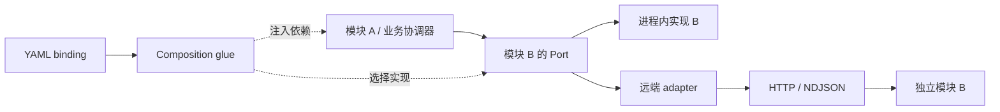

# PilotDeck / StaffDeck 通用模块架构、通信与接入指南

本文面向模型、工具、知识、检索、业务服务等通用模块，回答模块怎样独立开发、模块间怎样通信、glue 负责什么、YAML 能配置到什么程度，以及怎样测试。SOP 是领域模块的一个案例，专用协议与启动方式放在附录。

**可以通过 Port + adapter + composition glue 接入通用模块，模块内部不必依赖 SOP。当前分支已支持一组明确的模块插槽及其外部实现，但还不是任意依赖图的 YAML 编排引擎。** 已有契约的新实现可以只改配置；新增契约或模块间依赖，仍需定义接口并补装配代码。

核对日期：2026-09-21。代码依据是以下分支的当日提交，而非当前工作区分支：

| 仓库 | 分支 | 核对提交 |
| --- | --- | --- |
| OpenBMB/PilotDeck | `codex/merge-sdk-staffdeck` | `e2b4bdc7a72daf89a1f068b0539fcbe6ad8f25aa` |
| OpenBMB/StaffDeck | `codex/portable-sop-runtime` | `b43fe67a07a258829a2046994b4e400f2b08e767` |

文中的 **PD/**、**SD/** 分别表示这两个仓库在上述提交的根目录。末尾提供固定提交的源码链接。本文是开发指南，不是本次重新运行七模块验收的报告。目标分支的产品 README 标为 `NOT READY`，而 `ACCEPTANCE.md` 标为 `READY`，存在文档状态冲突；应以具体代码、声明范围和对应测试证据评估新模块，不能继承历史 PASS。

## 1. 先决定：新实现、新能力，还是新插槽

**已有插槽的新实现：实现契约、发布 manifest、配置 YAML、跑接入测试。真正新增插槽：先扩展宿主的类型、解析器、Port、装配和调用点，再开放 YAML。** YAML 是装配声明，不是任意代码加载器。

| 需求 | 推荐入口 | 是否修改宿主 |
| --- | --- | --- |
| 增加订单查询、报表生成等业务动作 | Tool 能力；复用现有工具扩展，或实现外部 `tools` 插槽 | 已支持契约内通常不需要；注意外部 binding 是插槽级配置，不是向原生目录随意追加一项 |
| 换知识服务、Skill 服务、模型服务 | 对应已有插槽的新实现 | 满足已有契约时不应添加厂商分支 |
| 增加一个业务流程 | SOP definition YAML | 通常不需要开发运行时模块 |
| 换 SOP 执行实现 | `sop.lifecycle/v2` 服务 | 满足现有 `prepare/submit` 契约时不需要 |
| 换 AgentLoop | stdio/TCP sidecar | 实现 Module Protocol 与 AgentLoop 语义；不能当普通 HTTP 模块接入 |
| 增加全新 `modules.billing` | 新 Port + 新插槽 | 需要；当前未知模块键仅产生 warning，不会被装配执行 |
| 只向 StaffDeck Harness 注册 Python 能力 | StaffDeck 进程内 provider SPI | 与 PilotDeck YAML 装配是不同扩展入口，见第 7 节 |

优先采用最窄的现有能力边界。单个业务动作不需要复制 AgentLoop，也不必为它新建一个顶层模块类型。

### 1.1 当前“通用”的范围

| 能力 | 当前支持情况 | 开发者需要做什么 |
| --- | --- | --- |
| 同一接口换不同厂商/语言实现 | 支持已有插槽的协议绑定 | 实现公开契约，配置 endpoint/transport，验证 consumer |
| 进程内调用与跨进程调用隔离 | 已有原生 Port 与远端 adapter 实践 | 模块依赖 Port，由装配层选择实现 |
| 新业务能力 | 可走 Tool 或自行定义模块 Port | 选合适入口；业务动作无需先定义 SOP |
| 模块 A 依赖模块 B | 可在代码中通过 Port 与 glue 显式接线 | 明确依赖契约、调用方向和 owner，添加组合测试 |
| 任意 `modules.xxx` 自动发现并执行 | 未提供通用机制 | 新插槽要修改解析、契约、装配及 consumer |
| YAML `dependsOn` / `routes` 自动构造依赖图 | 当前模块配置未提供这些通用字段 | 不要写入配置后假定生效；需要另行实现装配能力 |
| 任意方法透传、跨模块事件总线、通用分布式事务 | 不能由现有 HTTP envelope 推导出支持 | 根据业务需求单独定义契约和 owner |

“可复用传输”与“支持任意领域契约”是两件事：`HttpModuleClient` 可以复用，但 slot、wire module 名、methods 和 consumer 都有显式约束。把任意服务改成返回 JSON，并不能自动成为可用模块。

### 1.2 模块间靠 glue 通信，可以吗？

**可以。推荐模块面向窄 Port，glue 将 Port 接到选定的实现；真正调用可发生在进程内，也可通过 adapter 跨进程。** glue 不必成为独立服务，不需要每次调用都经过一个中心代理，更不要求每个模块都包装成 HTTP 服务。



这张图表达架构方式；它不表示当前 YAML 能自动构造任意 A→B 关系。图中的每个依赖仍须有真实装配与调用代码。

| 层 | 负责 | 不应承担 |
| --- | --- | --- |
| 领域模块 | 业务算法、自己的数据和状态、不变量 | 读取另一个模块私有表、依赖具体宿主内部对象 |
| Port / contract | 方法、输入输出、错误、时限、状态与副作用语义 | HTTP URL、进程对象等实现细节 |
| adapter | 序列化、协议转换、连接、错误映射、传输取消 | 擅自改变业务默认值、排序、权限或重试语义 |
| composition glue | 选择实现、注入依赖、注册 consumer、资源创建/释放接线 | 根据厂商名称复制业务逻辑、维护第二套领域状态 |
| 业务协调器（需要时） | 多模块调用顺序、业务分支、补偿、跨调用状态 | 伪装成纯 glue，把业务规则隐藏在转换代码里 |

例如“检索证据 → 生成报告 → 保存报告”：这是一个业务协调器依赖 RetrievalPort、ModelPort、ReportStorePort 的应用功能。glue 只选择三个实现并注入；检索排序在检索模块，模型调用在模型模块，持久化在存储模块。“保存失败时是否重新生成或补偿”是业务协调规则，不应由 HTTP adapter 决定。这个流程可以用普通代码实现，不要求使用 SOP。

### 1.3 模块 A 调模块 B 的两种可行接法

**宿主协调/注入**：宿主持有 A 和 B 的 Port，将 B 的 Port 注入 A，或由宿主应用协调器分别调用 A、B。适合复用宿主的权限、预算、取消和执行状态。当前 AgentLoop 通过 model/tools/context Port 工作，外置 sidecar 又可通过声明的 host module callbacks 调回宿主，是这种方式的具体实践。

**模块服务内部依赖**：独立服务 A 在自己的 composition root 中把 B 的 client adapter 注入领域逻辑，A→B 直接通信。适合 A 自己拥有的内部业务依赖，不需要流量绕回 PilotDeck。但该依赖由 A 的部署配置和契约负责；PilotDeck 的 `modules` YAML 不会自动配置它，也不会自动为 A→B 传播宿主身份、预算或取消。

当前分支可核对的 glue 入口：

- `PD/src/composition/runtimePorts.ts` 的 `createRuntimeModulePorts`：把选定 HTTP binding 转成 Model/Tool/Context Port。
- `PD/src/agent/session/AgentSessionRuntimeBundle.ts`：选择并注入会话使用的 Port，同时接宿主的执行状态与资源作用域。
- `PD/src/composition/domainPorts.ts`：适配 Skill/Knowledge，并把 Knowledge 查询包装成宿主工具。
- `PD/src/cli/ProjectSessionRuntimeBundle.ts`：接入 Skill contribution 和 Knowledge 工具 consumer。

选择时先确认 owner。若 B 是宿主限定访问的能力，就经宿主已授权的 Port 调用；若 B 是 A 的私有依赖，由 A 管理。若不同模块要订阅事件，另行明确事件 schema、顺序、持久化和投递保证；现有可选 `event.emit` 回调不等于通用消息总线。

### 1.4 新模块的一般开发顺序

1. 定义领域职责和对外 Port，列出依赖的其他 Port。
2. 先实现与宿主无关的领域逻辑，用 fake Port 测正常和失败路径。
3. 在 composition root 注入真实依赖；同进程直接调用即可。
4. 需要独立部署/跨语言时增加 transport adapter，保持同一领域契约。
5. 映射到已有插槽，或按第 8 节扩展新插槽；再开放 YAML binding。
6. 验证单模块、A→B 调用与故障传播，最后验证宿主业务闭环。

下面是**架构示意 TypeScript**，不是仓库已发布的 Report API；这些新 Port 若作为顶层模块开放，仍需按第 8 节接线：

```typescript
type CallContext = { requestId: string; signal?: AbortSignal };
type Evidence = { text: string; sourceId: string };
interface RetrievalPort {
  search(query: string, context: CallContext): Promise<Evidence[]>;
}
interface ReportModelPort {
  generate(evidence: Evidence[], context: CallContext): Promise<string>;
}

class ReportService {
  constructor(private retrieval: RetrievalPort, private model: ReportModelPort) {}
  async create(query: string, context: CallContext): Promise<string> {
    const evidence = await this.retrieval.search(query, context);
    return this.model.generate(evidence, context);
  }
}

// composition glue：这两个参数可以是本地实现，也可以是远端 adapter。
function composeReport(retrieval: RetrievalPort, model: ReportModelPort) {
  return new ReportService(retrieval, model);
}
```

`AbortSignal` 只存在本地 Port 中，远端 adapter 需转换成本地传输取消或已协商的远端取消。示例的 requestId 用于本地关联；实际多次下游调用应遵守所选 wire 协议的身份规则，不能把所有子调用复用成一个 wire requestId。

## 2. 当前有哪些插槽

来源：`PD/src/composition/types.ts`、`registry.ts`、`PD/src/pilot/config/parseModulesConfig.ts`。

| YAML 键 | contract | 外部 transport | 配置校验的最少方法 | 实现职责 |
| --- | --- | --- | --- | --- |
| `agentLoop` | `pilotdeck.agent-loop/v1` | `module-stdio-v2` / `module-tcp-v2` | `execute` | 模型/工具循环、停止、取消及事件；宿主仍持有 session/run 最终状态 |
| `modelProvider` | `pilotdeck.model/v1` | `module-http-v2` | `prepare`, `stream` | canonical 模型请求、模型事件、usage、错误；可协商增量 pull |
| `tools` | `pilotdeck.tools/v1` | `module-http-v2` | `execute` | 工具目录、调用、结果和副作用边界 |
| `context` | `pilotdeck.context/v1` | `module-http-v2` | `prepare_for_model` | 上下文准备、工具结果投影、恢复、压缩等已声明方法 |
| `skills` | `pilotdeck.skills/v1` | `module-http-v2` | `list`, `read` | Skill 发现/读取；完整管理面另有 create/write/delete/validate/import/scan |
| `knowledge` | `staffdeck.knowledge/v1` | `module-http-v2` | `query` | 检索及声明的库、版本、文档、任务、引用等管理操作 |
| `sop` | `sop.lifecycle/v2` | `sop-http-v2` | descriptor 中的 `prepare`, `submit` | SOP 图规则、提交校验、生命周期计算 |

表中的“最少方法”只表示配置可以通过，**不表示完整模块能力已经交付**。只实现 `query` 可以做查询试验，不能宣称完成知识管理；只实现 `list/read` 不能宣称覆盖 Skill CRUD。

配置规则：

- 原生实现使用 `{ enabled: true, provider: pilotdeck }`；外部实现使用 `implementationId/contract/transport/...`。两种字段不能混用。
- 显式禁用支持 `skills`、`knowledge`、`sop`。不能显式把核心 AgentLoop、Model、Tool、Context 配成 `enabled: false`；省略某配置的兼容默认行为不等于支持禁用。
- 外部模块应显式列出 `methods`。通用插槽省略此字段时解析器会采用该插槽全部支持方法，可能导致只实现一小部分的服务握手失败。
- 外部 Tool 必须提供非空 `catalog`，供同步工具目录读取；YAML 字段是 `catalog`，解析后的内部 binding 才叫 `tools`。
- AgentLoop 外置且还绑定其他外部核心模块时，解析器要求六个核心插槽均显式声明。新 profile 建议始终写清七个插槽。
- `schemaVersion: 1` 是配置版本，`protocolVersion: "2.0"` 是通信版本，`.../v1` 或 `.../v2` 是领域契约版本，三者不要混淆。

## 3. 开发前写清 ownership 边界

每个模块至少提交以下表格；它比先写 HTTP handler 更重要。

| 项目 | 必须回答的问题 |
| --- | --- |
| 输入与输出 | 方法名、必填/可选/null、单位、结果顺序、空结果、扩展字段是什么？ |
| 状态 | 谁创建、谁持久化、谁迁移版本、谁恢复？并发写入如何判旧？ |
| 副作用 | 哪些方法会写数据/触发外部动作？重复请求、超时、取消后怎么核实结果？ |
| 身份 | 哪个 ID 属于业务对象，哪个属于 run/operation/request？租户和 actor 从哪里绑定？ |
| 失败 | 业务错误、协议不兼容、传输失败分别如何返回？能否重试？ |
| 依赖 | 数据库、索引、模型、文件、worker、权限、时限由谁提供？ |
| 生命周期 | 启动、健康检查、就绪、关闭、在途请求、重启由谁负责？ |
| 兼容性 | 这是第三方新行为，还是原实现的外置封装？后者的独立对照入口是什么？ |

通用边界约定：

1. **每类状态有唯一 owner。** 模块可以无状态，也可以拥有自己的数据库、索引或 job。无状态不是可插拔的前提；对外承诺必须说明状态如何读写、恢复和迁移。
2. **宿主执行状态与模块业务状态分开。** PilotDeck 承载会话的组合中，由 PilotDeck 管理 Session、Turn、Run 和 Transcript；StaffDeck 作为宿主调用 PilotDeck sidecar 时则保留自己的宿主责任。不能把“所有状态永远归 PilotDeck”写成通用规则。
3. **glue 不复制领域算法。** 只转换与接线；需要多步业务编排时建立有名称、有契约、有测试的协调器。SOP 可以承担部分协调，但不是唯一方式。
4. **依赖通过公共 Port。** 避免模块 A 直接读 B 的内部表或创建 B 的内部类；A 不需要知道 B 是原生实现还是 HTTP 服务。
5. **调用上下文要有明确映射。** 规定身份、关联 ID、剩余预算、时限和取消由谁产生、由谁传递。不能因使用 JSON envelope 就假定这些语义已自动实现。
6. **序列化数据，不序列化运行时对象。** 传 canonical messages、JSON 参数和结果；不传 ORM Session、Router 内部对象、SDK client、AbortSignal、权限执行器或任意函数。
7. **每层只承担约定的失败处理。** transport 报告不可达/超时，领域模块判定业务错误，副作用 owner 提供结果核实，协调器按契约决定补偿或重试。避免 A、glue、B 三层各自重试导致调用放大。
8. **身份与访问范围显式绑定。** 模型传来的 ID 不能直接作为授权证明。当前通用 HTTP binding 没有任意鉴权 headers 配置，不要凭空添加 YAML `auth` 字段并假定生效。

SOP 的宿主持久状态与 Knowledge 的模块自有数据库，是两种不同 ownership 实例，见附录；新模块应根据自己的语义选择。

## 4. 通用通信：本地 Port 与远端 adapter

进程内模块通过类型化 Port 直接调用，不需要通信 envelope；隔离部署时由 adapter 实现该 Port。下面介绍当前通用 HTTP 和 AgentLoop NDJSON 两类 transport。SOP 的专用 HTTP 协议放在附录 A。

### 4.1 普通外部模块：`module-http-v2`

实际调用链：

```text
pilotdeck.yaml
  -> parseModulesConfig / contract registry
  -> composition Port
  -> HttpModuleClient
  -> GET manifest（首次调用时加载并缓存）
  -> POST module_call
  -> 模块自己的 adapter -> 领域 owner
  -> response -> Port -> 宿主 consumer
```

默认地址是 `GET /module-manifest` 和 `POST /v2/module/call`，可通过 `manifestPath/callPath` 改路径。它复用 Module Protocol 的 `module_call` 信封，**不是每次先调用通用 `hello/capabilities/execute`**。后者用于第 4.2 节的 AgentLoop transport。

以一个只提供 Skill 读取的实现为例，manifest：

```json
{
  "protocolVersion": "2.0",
  "implementationId": "acme.skills",
  "contract": "pilotdeck.skills/v1",
  "transport": "module-http-v2",
  "methods": ["list", "read"]
}
```

`implementationId/contract/transport/protocolVersion` 必须与配置及客户端预期一致；服务方法集合必须覆盖 YAML 声明的方法。

请求示例：

```json
{
  "kind": "request",
  "messageId": "module-http-1",
  "method": "module_call",
  "runId": "skills",
  "operationId": "skills",
  "requestId": "skills-read-1",
  "module": "skills",
  "payload": {"operation": "read", "input": {"name": "demo"}}
}
```

成功响应：

```json
{
  "kind": "response",
  "messageId": "response-module-http-1",
  "inReplyTo": "module-http-1",
  "requestId": "skills-read-1",
  "ok": true,
  "payload": {"result": "# Demo\n请先查询再回答。"}
}
```

失败响应可以使用相应 HTTP 4xx/5xx，但 body 仍须是合法信封：

```json
{
  "kind": "response",
  "messageId": "response-module-http-1",
  "inReplyTo": "module-http-1",
  "requestId": "skills-read-1",
  "ok": false,
  "code": "INVALID_ARGUMENTS",
  "error": {
    "code": "INVALID_ARGUMENTS",
    "message": "name must be a non-empty string",
    "retryability": "unsafe"
  }
}
```

注意：

- `inReplyTo` 关联请求的 `messageId`；建议始终返回原 `requestId`。当前 HTTP client 在它出现时检查一致性。
- `module_call` 的响应不用照抄 streaming execute 的 `final/streamId/sequence`。成功 payload 由领域 consumer 决定：Skill/Knowledge 是 `{result}`；Model、Tool、Context 应使用各自 host port 的具体形状，不能统一包成 `{result}`。
- `modelProvider` 是 YAML 插槽名，wire module 使用模型端口定义的 `model`；`tools` 对应 `capability`。不要机械地把 YAML 键复制到 `module`。
- 失败时顶层 `code` 与 `error.code` 相同，`error.message` 非空，`retryability` 为 `safe/unsafe/retry_after_status`。保留领域原错误码。
- 默认 HTTP 请求超时为 10 秒；`timeoutMs` 是传输超时，不是服务端已经撤销副作用的证明。客户端本地 abort 不会自动生成远端 cancel API。
- `HttpModuleClient` 不自动重试。其超时、取消、不可达错误带 `result_unknown`；领域 adapter 是否完整传播还需按方法测试，不能假定已有通用 durable ledger。
- 当前 Skill/Knowledge Port 使用固定领域 `runId/operationId` 和本地递增 `requestId`，并不自动为写入补稳定幂等键。新写入实现必须另行明确业务幂等/状态查询，不要直接用固定 `operationId` 去重。

### 4.2 AgentLoop：双向 NDJSON

AgentLoop 通过 `module-stdio-v2` 或 `module-tcp-v2` 运行，采用 `hello/capabilities/execute`，按声明支持 `cancel/status/resume/ack`。业务执行中 sidecar 可反向发 `module_call` 调宿主的 model、capability、context 等端口。

这里必须遵守 `PD/docs/pilotdeck-module-communication-sop.zh.md` 和协议 schema：

- `runId` 隔离运行；`operationId` 跨 retry 保持；每次 attempt 换 `requestId`；工具 `toolCallId` 跨 retry 稳定。
- 每个 request 至多一个终态；operation 最终结果由宿主聚合。已提交 completed 不能被迟到 cancel 覆盖。
- 流按 `(streamId, sequence)` 去重；gap、旧 run/binding、cursor 过期必须显式处理。
- `result_unknown` 进入 resolving，先查询后决定；副作用的 `idempotencyKey` 稳定，retry 不延长 operation deadline。
- 只调用宿主广告的方法；模型 provider iterator、权限与工具运行环境仍由相应 owner 管理。

不要为了一个普通 HTTP Skill 服务额外实现完整 AgentLoop 流恢复状态机。

## 5. 从零接入示例：只读 Skill 服务

此例是**最小协议联调实现**，可实际启动，提供 `list/read`；它不代表完整 Skill 管理服务，也不代表原生 Skill 的 scope/CRUD/发现顺序等价。

建议模块自己的仓库至少包含 `server.py`、依赖配置、测试、manifest 说明、profile，以及需要独立部署时的 Dockerfile。先把下面代码保存为模块仓库的 `server.py`：

```python
from typing import Any, Literal
from fastapi import FastAPI
from fastapi.responses import JSONResponse
from pydantic import BaseModel

app = FastAPI()
CONTENT = "---\nname: demo\ndescription: 查询后回答\n---\n请先查询再回答。\n"
MANIFEST = {
    "protocolVersion": "2.0",
    "implementationId": "acme.skills",
    "contract": "pilotdeck.skills/v1",
    "transport": "module-http-v2",
    "methods": ["list", "read"],
}

class Call(BaseModel):
    kind: Literal["request"]
    method: Literal["module_call"]
    messageId: str
    runId: str
    operationId: str
    requestId: str
    module: Literal["skills"]
    payload: dict[str, Any]

@app.get("/module-manifest")
def manifest():
    return MANIFEST

@app.post("/v2/module/call")
def call(req: Call):
    base = {
        "kind": "response", "messageId": "response-" + req.messageId,
        "inReplyTo": req.messageId, "requestId": req.requestId,
    }
    operation = req.payload.get("operation")
    data = req.payload.get("input")
    def reject(code, message):
        return JSONResponse(status_code=400, content={
            **base, "ok": False, "code": code,
            "error": {"code": code, "message": message, "retryability": "unsafe"},
        })
    if not isinstance(data, dict):
        return reject("INVALID_ARGUMENTS", "input must be an object")
    if operation == "list":
        result = [{"name": "demo", "path": "skills/demo/SKILL.md",
                   "description": "查询后回答", "content": CONTENT}]
    elif operation == "read":
        name = data.get("name")
        if not isinstance(name, str) or not name.strip():
            return reject("INVALID_ARGUMENTS", "name must be a non-empty string")
        result = CONTENT if name == "demo" else None
    else:
        return reject("METHOD_NOT_SUPPORTED", "unsupported operation")
    return {**base, "ok": True, "payload": {"result": result}}
```

启动与最小请求（在模块仓库内执行）：

```bash
python3 -m venv .venv
.venv/bin/python -m pip install fastapi uvicorn
.venv/bin/python -m uvicorn server:app --host 127.0.0.1 --port 9022
```

```bash
curl --fail-with-body http://127.0.0.1:9022/module-manifest
curl --fail-with-body http://127.0.0.1:9022/v2/module/call \
  -H 'Content-Type: application/json' \
  -d '{"kind":"request","method":"module_call","messageId":"m1","runId":"r1","operationId":"o1","requestId":"q1","module":"skills","payload":{"operation":"read","input":{"name":"demo"}}}'
```

示例返回 inline `content`，`path` 是目录描述字段，不代表宿主可以读远端文件。涉及附件或只有文件路径的实现，必须另行定义宿主可访问性。示例的非法外层信封会触发 FastAPI 默认 422；正式服务应像 StaffDeck facade 一样把 validation error 转换为结构化协议错误，补齐对应测试和依赖版本锁定。

将以下 **modules 配置片段** 合并进已有可运行的 `pilotdeck.yaml`；原有 `schemaVersion/agent/model` 配置仍需保留：

```yaml
modules:
  agentLoop: { enabled: true, provider: pilotdeck }
  modelProvider: { enabled: true, provider: pilotdeck }
  tools: { enabled: true, provider: pilotdeck }
  context: { enabled: true, provider: pilotdeck }
  skills:
    enabled: true
    implementationId: acme.skills
    contract: pilotdeck.skills/v1
    transport: module-http-v2
    endpoint: http://127.0.0.1:9022
    manifestPath: /module-manifest
    callPath: /v2/module/call
    timeoutMs: 10000
    methods: [list, read]
    deployment:
      mode: external
  knowledge: { enabled: false }
  sop: { enabled: false }
```

修改已有 PilotHome 的配置后，在目标 PilotDeck 分支运行 `npm run server`（使用隔离 PilotHome 联调时显式设置 `PILOT_HOME`）。先验证 Skill 发现和 read 消费，再验证会话行为；不要因 curl 成功就宣布集成完成。若启用 Skill 管理 UI/调用管理 API，则需实现管理面完整结果形状和相关方法，不能用此简化返回值代替。

## 6. 通用模块的部署与生命周期

### 6.1 导出部署

在 PD 根目录，对保存好的完整 profile 执行：

```bash
npm run export:staffdeck-sop -- \
  --profile /absolute/path/to/pilotdeck.yaml \
  --out /tmp/acme-pilotdeck-export
docker compose -f /tmp/acme-pilotdeck-export/compose.yaml config
```

需要 exporter 获取 StaffDeck 源码的组合可加 `--staffdeck-root /absolute/path/to/StaffDeck`。

| deployment.mode | 责任 |
| --- | --- |
| `external` | 仅保留 endpoint，服务由部署方启动；exporter 不替你启动 |
| `image` | 指定 `image`、容器 `port`，生成托管服务 |
| `build` | 指定 `context`、`dockerfile`、`port`，exporter 从 profile 目录解析构建源并复制 |

托管服务 endpoint 会被改写为 Compose 服务地址；`external` endpoint 要从 **PilotDeck 所在网络**可达。Docker 中的 `127.0.0.1` 是该容器自己，不是宿主机，也不是另一个模块容器。

当前 exporter 生成的通用 `healthPath` 检查使用 `node -e fetch(...)`；纯 Python 镜像没有 Node 时不能直接假定此健康检查可用，需要调整生成的 Compose 检查或提供适用运行环境。数据库、worker、volume 等额外依赖也不能指望仅靠一个 endpoint 自动生成。

检查生成配置后再启动隔离组合：`docker compose -f /tmp/acme-pilotdeck-export/compose.yaml up --build -d`。服务存活、manifest 兼容、领域操作可用、业务 E2E 通过是四个不同结论。

### 6.2 资源与依赖的生命周期

每个模块说明谁创建和关闭连接池、worker、临时文件及流迭代器。composition glue 接好资源释放路径；模块实现释放自己拥有的资源。依赖启动或初始化失败时不能对外发布“已经可用”的半成品模块。

当前 manifest 检查主要确认身份、版本、transport 和方法集，通常在调用时触发；它不是完整的依赖就绪检测。对 A→B 依赖，需要额外验证 B 就绪与能力兼容，并说明 B 故障时 A 的行为。数据库、队列等有状态依赖要在部署方案中明确列出。

## 7. 如果模块只接入 StaffDeck Python Harness

这条路径不使用 PilotDeck 的 `modules.*` YAML。它使用 StaffDeck 模块注册表、entry point / `pkg.mod:register` 与运行时配置。不要把旧版设计里的 `invoke(host, inv)` 示例当现行公共 SPI。

当前接口是：

```python
from staffdeck_harness.contracts.provider import ProviderContext
from staffdeck_harness.contracts.invocation import ModuleInvocation, ModuleResult

class MyProvider:
    def invoke(self, context: ProviderContext,
               invocation: ModuleInvocation) -> ModuleResult:
        # 使用 context 的已授权资源、配置、剩余时限和事件接口。
        # 调自己的领域服务，返回 ModuleResult；不接收宿主 ORM/AgentLoop。
        ...
```

实施顺序：定义 operation 的输入/输出和策略映射 → 编写 provider → `register(registry, ctx)` 安装 manifest/provider 到合法 slot → 配置模块与资源绑定 → registry 校验/seal → 定向测试。注册可通过 `staffdeck_harness.modules` entry point 或外部模块规格串完成。新 operation 用当前 registry 的 operation 注册能力与契约模型，而不是只改 manifest 字符串。

参考 `SD/backend/src/staffdeck_harness/contracts/provider.py`、`contracts/operations.py`、`modules/registry.py` 和 `capabilities/host.py`。若还要让 PilotDeck 使用它，应再提供已有 HTTP 插槽的 facade；Python 注册不会自动生成 PilotDeck descriptor 或 HTTP endpoint。

## 8. 如果确实要增加新插槽

以 `modules.billing` 为例，这是宿主能力开发，不是厂商实现接入。按以下依赖顺序完成：

1. 定义 `BillingPort`、领域 schema、方法集、状态/副作用 owner，并确定真正调用它的业务 consumer。没有 consumer 的 YAML 字段没有作用。
2. 扩展 `PD/src/composition/types.ts` 的插槽/契约定义，以及 `registry.ts` 的支持方法和必选方法规则。
3. 扩展 `PD/src/pilot/config/types.ts`、`parseModulesConfig.ts`：合法键、字段校验、禁用/默认/冲突规则。若引入新 wire module 名，同步扩展 `PD/src/agent/modules/protocol.ts` 及对应 JSON schema/validator。
4. 在 composition 层提供 native/external adapter，复用通用 transport。新增具体厂商不能在宿主出现 `if implementationId == acme...`。
5. 注入真实 runtime consumer。现有入口可参考 `AgentSessionRuntimeBundle.ts`、`ProjectSessionRuntimeBundle.ts`、`createLocalGateway.ts`，按能力实际归属接线，不要把所有业务塞进 AgentLoop。
6. 扩展 exporter 中的插槽枚举、来源解析和产物生成；运行时解析器与 exporter 是两套检查，都要覆盖。
7. 增加契约、解析、Port、consumer、导出测试；冻结宿主后，用另一个独立实现只改 YAML 做接入验证。

新增方法/字段时明确兼容规则：可选扩展必须协商后才调用；改变必填字段或已有语义需要升级契约。当前 registry 对 contract 做精确比较，不能把 `/v2` 写进配置就认为宿主自动兼容。

## 9. 测试分层与验收标准

测试强度由模块行为决定：只读 unary 不需要全套流恢复；有副作用、跨进程状态或宿主生命周期影响的模块必须覆盖对应故障边界。

| 层级 | 最少用例 | 通过条件 |
| --- | --- | --- |
| 领域单测 | 正常、空结果、非法输入、边界值、领域错误 | 直接测 owner，不只测 HTTP JSON 往返 |
| 配置/manifest | 合法 binding；错误 contract/version/transport；缺方法；配置冲突 | 不兼容时明确拒绝，不偷偷切回原生实现 |
| 协议信封 | request 关联、错误码一致、非法 JSON/结构、未知方法 | 错误保留且可识别；不能拿 HTTP 200 代替业务成功 |
| Port/consumer | 真正调用模块、读取结果、工具目录/上下文消费、禁用分支 | 证明调用链已经接通，而不只是服务有 endpoint |
| glue / 模块依赖 | A→B 的参数、结果和错误映射；依赖缺失、超时、取消、资源释放；本地/远端替换 | A 不感知具体实现；业务错误不被吞掉，调用次数和上下文映射符合契约 |
| 协调器（适用时） | 多模块调用顺序、部分完成、补偿、重复业务请求 | 业务策略有独立测试，不藏在 transport adapter |
| 故障 | 超时、断连、取消、迟到响应、重启 | 不重复提交终态、不把 unknown 当成功、不盲重试写入 |
| 状态/副作用（适用时） | 幂等、重复提交、并发 revision、部分成功、恢复查询 | 由唯一 owner 提交并可核实实际结果 |
| 流（适用时） | 重复/乱序/gap、旧 binding、resume、cursor 过期 | 无重复工具结果，旧流不污染新 run |
| 独立实现接入 | 宿主冻结后换 implementationId/endpoint/profile | 不改宿主源码、不新增厂商注册；实际领域操作和错误路径均通过 |
| 业务 E2E | 真实 Gateway/session/模块进程完成一次业务闭环 | 看见真实模块回执、宿主状态及可恢复结果 |

以下仅是现有插槽的专项补充；新模块按自己的公开契约补充，SOP 用例不是所有模块的统一门槛：

- SOP：必填槽为空/空白、非法跳转、缺真实工具回执、handoff、external wait、重复 resume、旧 revision、状态提交与回复投递之间崩溃。
- Knowledge：tenant/actor 隔离、库版本、导入 job、取消/重启、查询证据和引用、写入结果不明后的查询；只读验收与完整管理面验收分别报告。
- Tool：目录/schema、allow/deny/ask、同名冲突、批量结果顺序、不安全工具顺序、副作用未知结果。
- Model/Context：请求和事件次序、tool call/result 配对、usage、上下文限制、溢出恢复、压缩持久化；不以最终回答相同替代这些比较。
- Skill：scope、发现顺序、同名冲突、内容读取、管理面结果结构；完整替换时覆盖 CRUD/导入/校验/扫描。

### 9.1 替换原模块时增加独立语义对照

三种证据不能互相代替：

- **B0 → N0**：固定原始实现与解耦后的原生入口比较，识别已有语义漂移。
- **N0 → C，以及 B0 → C**：外置/装配候选与原生/原始入口比较。
- **独立实现 conformance**：第三方只遵循公开协议，不要求复制原实现内部算法。

原实现外置时，用相同输入、fixture、模型响应和逻辑时间比较状态、错误、顺序、usage、工具次数和副作用。expected 不应由待测 adapter 自己生成。新开发的第三方行为没有历史 B0 时，明确“不适用”，以公开契约和业务需求验收；不要捏造等价证明。

### 9.2 现有定向命令与测试入口

在对应目标分支与已安装依赖的环境执行。PilotDeck 要求 Node `>=22.13.0 <23`，使用仓库声明的 pnpm。首次验证先构建；后续仅跑受影响测试，不默认跑全仓。

```bash
# PD 根目录；首次准备
pnpm install --frozen-lockfile
npm run build

# 普通 YAML/HTTP 模块接入
node --test \
  dist/tests/pilot/config/modules-config.spec.js \
  dist/tests/composition/http-module-runtime.spec.js \
  dist/tests/composition/runtime-ports.spec.js \
  dist/tests/composition/export-composition.spec.js

# 触及 AgentLoop Module Protocol 时
node --test dist/tests/protocol/module-protocol-contract.spec.js \
  dist/tests/agent/modules/module-protocol.spec.js

# 触及 SOP 时；服务已监听 8091
node --test dist/tests/sop/staffdeck-sop-agent-loop.spec.js \
  dist/tests/sop/staffdeck-sop-client.spec.js \
  dist/tests/sop/staffdeck-sop-definitions.spec.js
STAFFDECK_SOP_E2E_ENDPOINT=http://127.0.0.1:8091 \
  node --test dist/tests/sop/staffdeck-sop-gateway-http-e2e.spec.js
```

```bash
# SD 根目录，复用后端隔离依赖环境
PYTHONPATH=backend:backend/src:portable_sop/src \
  backend/.venv/bin/python -m pytest -q portable_sop/tests

# 涉及 Knowledge facade 时
PYTHONPATH=backend:backend/src \
  backend/.venv/bin/python -m pytest -q backend/tests/test_module_knowledge.py
```

另有 `PD/products/pilotdeck-staffdeck-sop/conformance/run-sop-conformance.mjs` 用于独立 SOP 服务接入，`tests/composition/external-session-e2e.spec.ts` 用于外部模块会话链路，`real-staffdeck-seven-slot-e2e.spec.ts` 用于更大组合。后一测试需要显式配置 `STAFFDECK_SOP_ROOT/STAFFDECK_PYTHON` 等环境；只有共享装配行为受影响时才扩大到该组合。环境缺失导致的 skip 不能记录为业务 PASS。

### 9.3 一个模块的交付清单

- owner-contract 表、输入/输出 schema、错误与重试语义。
- 实现和薄 adapter；manifest；最小 profile；部署来源、Port 依赖图及 glue 接线位置。
- 正常及失败的实际请求/响应示例。
- 适用层级的测试及命令、退出码、环境、明确的 skip/阻塞；涉及模块间调用时包含 glue/依赖故障测试。
- 独立实现配置接入证据；原实现外置时另附独立语义对照。
- 兼容性与回退说明：切回旧 binding 前处理在途调用，持久数据是否向后兼容要单独说明，不能把改 YAML 当数据回滚。

本次文档交付仅核对上述目标提交、源码路径、配置与协议示例；没有重新执行两仓完整构建、真实部署或 B0 等价验收。

## 附录 A. SOP 专用协议：`sop-http-v2`

SOP 有独立 descriptor 和 HTTP 信封，不能指向普通 `/v2/module/call` handler。

| 路径 | 用途 | 关键字段 |
| --- | --- | --- |
| `GET /healthz`（可配置 manifestPath） | 健康状态和 descriptor | `status: ok`, `moduleId: sop.runtime`, `descriptorVersion: 1.0`, `implementationId`, `contract: sop.lifecycle/v2`, `transport: sop-http-v2`, `operations: [prepare, submit]`, `protocolVersion: 2.0` |
| `POST /v1/sop/prepare` | 从定义与状态准备当前步骤 | `payload: {bundle, state}` |
| `POST /v1/sop/submit` | 校验 proposal，计算生命周期结果 | `payload: {bundle, state, proposal, successfulToolNames}` |

路径仍叫 `/v1/sop/...`，不代表信封是协议 v1。请求示例：

```json
{
  "protocolVersion": "2.0",
  "runId": "run-1",
  "operationId": "sop-prepare-1",
  "requestId": "request-1",
  "sessionId": "session-1",
  "turnId": "turn-1",
  "expectedRevision": 0,
  "payload": {
    "bundle": {"sops": [{"id": "demo", "content": {
      "start_node_id": "finish",
      "nodes": [{"node_id": "finish", "instruction": "回答后结束。"}],
      "terminal_node_ids": ["finish"]
    }}]},
    "state": {"selected_skill_id": "demo"}
  }
}
```

成功为 `{protocolVersion, requestId, ok: true, outcome: "completed", payload}`；prepare 的 payload 包含 `state/step`，submit 包含 `state/result`。错误为 `ok: false, outcome: "failed", error: {code,message,retryability,details}`。详细字段按 `PD/src/sop/staffdeck/types.ts`，不要把 state 简化成单个步骤 ID。

服务接受 `expectedRevision/idempotencyKey/deadlineAt`，但当前 Python adapter 没有据此实现持久 CAS、去重或 deadline 检查。**接收字段不等于执行保证**；revision 提交、迟到响应隔离与恢复需要宿主保证。`successfulToolNames` 来自真实工具成功回执，不能把模型声称“已调用”作为完成证据。

Handoff/外部等待采用宿主两阶段恢复：先通过宿主 `/api/sop/resume` 接受恢复结果，再通过普通 chat 路径继续。不要在 SOP 服务里另启 AgentLoop 或直接结束宿主 turn。


## 附录 B. 复用 StaffDeck SOP

在 SD 根目录安装后端依赖，启动真正的 owner adapter：

```bash
python3 -m venv backend/.venv
backend/.venv/bin/python -m pip install -e 'backend[dev]'
PYTHONPATH=backend:backend/src:portable_sop/src \
  backend/.venv/bin/python -m staffdeck_sop_runtime
```

启动端口为 8091。在 PD profile 中配置：

```yaml
sop:
  enabled: true
  implementationId: staffdeck.portable-sop
  contract: sop.lifecycle/v2
  transport: sop-http-v2
  endpoint: http://127.0.0.1:8091
  manifestPath: /healthz
  definitionsPath: ./sops/operator-approval.yaml
  defaultSopId: operator_approval
  timeoutMs: 30000
  deployment: { mode: external }
```

以上是 `modules` 下的一个子项，不是完整 profile。定义可从 `PD/products/pilotdeck-staffdeck-sop/sops/operator-approval.yaml` 起步；业务 SOP 声明的工具还必须存在于宿主 Tool 目录。运行时相对路径依据 PilotHome 解析，exporter 对源 profile 的 definitionsPath 按 profile 所在目录解析并重写；不要从任意 cwd 猜路径。

## 附录 C. 复用 StaffDeck Knowledge

配置模板使用 `PD/products/pilotdeck-staffdeck-sop/profiles/native-five-staffdeck.yaml`。服务入口是 `SD/backend/app/module_knowledge_app.py`，路由在 `SD/backend/app/api/module_knowledge.py`。

从 SD 根目录启动命令形式为：

```bash
PYTHONPATH=backend:backend/src backend/.venv/bin/python -m uvicorn \
  app.module_knowledge_app:app --host 127.0.0.1 --port 8090
```

启动前先按 SD 的配置准备隔离数据库、存储目录和 actor；入口会初始化数据库并启动异步任务，不能把现有生产数据目录当联调 fixture。默认 seed 行为及 `STAFFDECK_KNOWLEDGE_SEED/USER_ID/TENANT_ID` 需按模块环境明确配置。

Knowledge wire 使用 `module: knowledge`、`payload: {operation, input}`；查询 input 包含 `query`，并按部署绑定 `tenantId/actorUserId`（也可由服务端对应环境配置提供），可带 `agentId/knowledgeBaseIds/...`。输出是 owner 的 JSON 投影，不要在桥接层重排证据。

必须区别“查询消费”和“知识管理”：PilotDeck 的 `knowledge_query` 工具只桥接 query；库、版本、文档、job 等完整操作由契约列出，不会因注册 query 工具而自动生成所有业务 UI。当前 `resolve_citation` facade 按 tenant 和 chunkId 读取 chunk；不能仅依据设计文字宣称此方法实现了全部不可变引用快照语义，需按目标场景验证。


## 10. 固定提交源码索引

PilotDeck：

- [插槽与 binding 类型](https://github.com/OpenBMB/PilotDeck/blob/e2b4bdc7a72daf89a1f068b0539fcbe6ad8f25aa/src/composition/types.ts)、[方法与契约校验](https://github.com/OpenBMB/PilotDeck/blob/e2b4bdc7a72daf89a1f068b0539fcbe6ad8f25aa/src/composition/registry.ts)、[YAML 解析](https://github.com/OpenBMB/PilotDeck/blob/e2b4bdc7a72daf89a1f068b0539fcbe6ad8f25aa/src/pilot/config/parseModulesConfig.ts)。
- [HTTP 客户端](https://github.com/OpenBMB/PilotDeck/blob/e2b4bdc7a72daf89a1f068b0539fcbe6ad8f25aa/src/composition/HttpModuleClient.ts)、[Skill/Knowledge Port](https://github.com/OpenBMB/PilotDeck/blob/e2b4bdc7a72daf89a1f068b0539fcbe6ad8f25aa/src/composition/domainPorts.ts)、[Model/Tool/Context Port](https://github.com/OpenBMB/PilotDeck/blob/e2b4bdc7a72daf89a1f068b0539fcbe6ad8f25aa/src/composition/runtimePorts.ts)。
- [SOP 类型与信封](https://github.com/OpenBMB/PilotDeck/blob/e2b4bdc7a72daf89a1f068b0539fcbe6ad8f25aa/src/sop/staffdeck/types.ts)、[SOP 客户端](https://github.com/OpenBMB/PilotDeck/blob/e2b4bdc7a72daf89a1f068b0539fcbe6ad8f25aa/src/sop/staffdeck/StaffDeckSopClient.ts)、[宿主 SOP 状态](https://github.com/OpenBMB/PilotDeck/blob/e2b4bdc7a72daf89a1f068b0539fcbe6ad8f25aa/src/sop/staffdeck/SopStateStore.ts)。
- [通信 SOP](https://github.com/OpenBMB/PilotDeck/blob/e2b4bdc7a72daf89a1f068b0539fcbe6ad8f25aa/docs/pilotdeck-module-communication-sop.zh.md)、[协议 schema](https://github.com/OpenBMB/PilotDeck/blob/e2b4bdc7a72daf89a1f068b0539fcbe6ad8f25aa/docs/pilotdeck-module-protocol-v2.schema.json)。
- [组合 profiles](https://github.com/OpenBMB/PilotDeck/tree/e2b4bdc7a72daf89a1f068b0539fcbe6ad8f25aa/products/pilotdeck-staffdeck-sop/profiles)、[exporter](https://github.com/OpenBMB/PilotDeck/blob/e2b4bdc7a72daf89a1f068b0539fcbe6ad8f25aa/products/pilotdeck-staffdeck-sop/scripts/export-composition.mjs)、[组合开发规范](https://github.com/OpenBMB/PilotDeck/blob/e2b4bdc7a72daf89a1f068b0539fcbe6ad8f25aa/products/pilotdeck-staffdeck-sop/DEVELOPMENT_SOP.md)。

StaffDeck：

- [portable SOP HTTP API](https://github.com/OpenBMB/StaffDeck/blob/b43fe67a07a258829a2046994b4e400f2b08e767/portable_sop/src/staffdeck_sop_runtime/api.py)、[原 owner 适配](https://github.com/OpenBMB/StaffDeck/blob/b43fe67a07a258829a2046994b4e400f2b08e767/portable_sop/src/staffdeck_sop_runtime/original_runtime.py)、[独立 owner 对照测试](https://github.com/OpenBMB/StaffDeck/blob/b43fe67a07a258829a2046994b4e400f2b08e767/portable_sop/tests/test_owner_contract.py)。
- [Knowledge API facade](https://github.com/OpenBMB/StaffDeck/blob/b43fe67a07a258829a2046994b4e400f2b08e767/backend/app/api/module_knowledge.py)、[Knowledge 进程入口](https://github.com/OpenBMB/StaffDeck/blob/b43fe67a07a258829a2046994b4e400f2b08e767/backend/app/module_knowledge_app.py)。
- [Python provider 公共接口](https://github.com/OpenBMB/StaffDeck/blob/b43fe67a07a258829a2046994b4e400f2b08e767/backend/src/staffdeck_harness/contracts/provider.py)、[模块 registry](https://github.com/OpenBMB/StaffDeck/blob/b43fe67a07a258829a2046994b4e400f2b08e767/backend/src/staffdeck_harness/modules/registry.py)。
